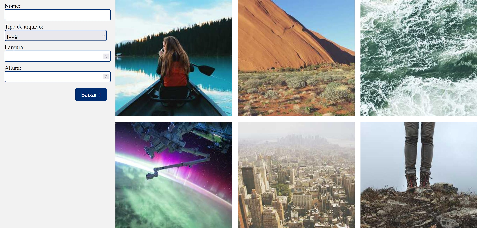

> [Teste frontend](readme.md)

# Parte 2 - HTML e CSS

Nesta parte vamos fazer algumas perguntas teóricas sobre HTML e CSS. Ao fim, pediremos a criação de um HTML simples, nesse caso sem o auxílio de frameworks.

## 2.1 - Perguntas teóricas

Na parte das perguntas seja o mais breve possível, durante a entrevista você poderá explicar melhor suas respostas se algo não estiver claro. Salve um arquivo chamado "Respostas.txt" copiando as perguntas e coloque suas respostas abaixo:

1) De quais formas você sabe utilizar CSS para estilizar suas páginas?
2) O que é um seletor CSS? Quais tipos de seletores você conhece?
3) O que faz este seletor: `div > p`?
4) Qual a diferença entre: `div > p`, `div p` e `div + p` , se é que há alguma?
5) Quais valores você conhece para a propriedade `display`? Explique cada um deles.
6) Quais valores você conhece para a proprieadade `position`? Explique cada um deles.
7) Se um usuário acessa uma página de um computador e vê um título com uma fonte, e outro usuário visualiza esta mesma página em um outro computador, e vê o mesmo título com uma fonte diferente, o que pode ter acontecido? Como você resolveria este problema?
8) Qual a diferença entre `font-size: 10px`, `font-size: 10em`, `font-size: 10rem` e `font-size: 10pt`?
9) De 1 a 5, diga quanto de cada um desses recursos você conhece:
    - Flex box
    - CSS grid
    - variáveis CSS
    - viewport
10) Quais sites você utiliza para consultar documentação de CSS? E como saber quais browsers suportam quais recursos?

## 2.2 - Implementação

### 2.2.1 - Básico

Nossa idéia aqui é avaliar sua familiaridade com HTML e CSS. Crie uma página simples, sem o auxílio de frameworks. Você deve criar um arquivo chamado "imagens.html" e outro "imagens.css". Neste arquivo, você deve criar uma página que contenha:

- um formulário ao lado esquerdo da página;
- uma lista de imagens do lado direito;
- a parte da esquerda deve ser fixa, ou seja, não deve rolar quando a página sofrer scroll;
- a parte da direita deve ser "scrollavel", ou seja, rolar junto com a página quando o scroll for feito;

Para as imagens você deve exibir 10 imagens aleatórias, é importante que elas tenham 500x500px. Você pode usar o site https://picsum.photos/ para gerar imagens aleatórias, com as URLs `https://picsum.photos/500`. Observe que toda vez queessa url é chamada, ela gera uma imagem aleatória diferente, no entanto se você simplesmente adicionar 10 tags `` em uma página com essa mesma URL as 10 imagens serão iguais. Consegue dizer por que isso acontece?. Conseguir utilizar esse site e garantir que as imagens sejam sempre diferente será um ponto positivo na avaliação.

Imagem de exemplo (parte2.jpeg):

### 2.2.2 - Avançado

Ganha um ponto extra quem conseguir o seguinte: garantir que as imagens apareçam na página sempre com um tamanho entre 200x200 e 500x500, ocupando o espaço da direita de forma uniforme, de modo que nunca fiquem espaços vazios. Sem utilizar JavaScript.